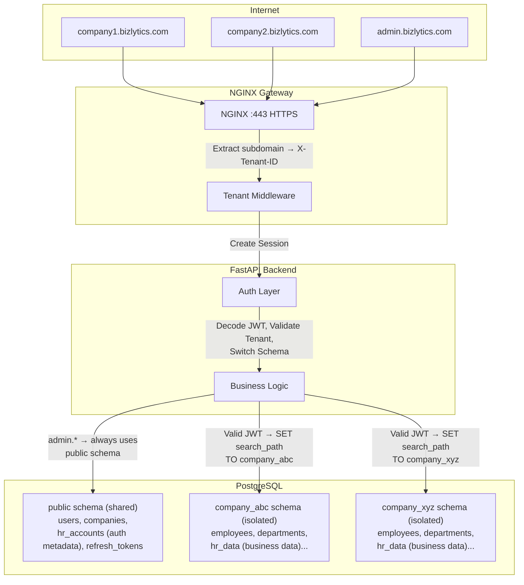
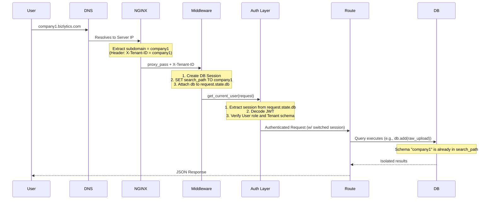
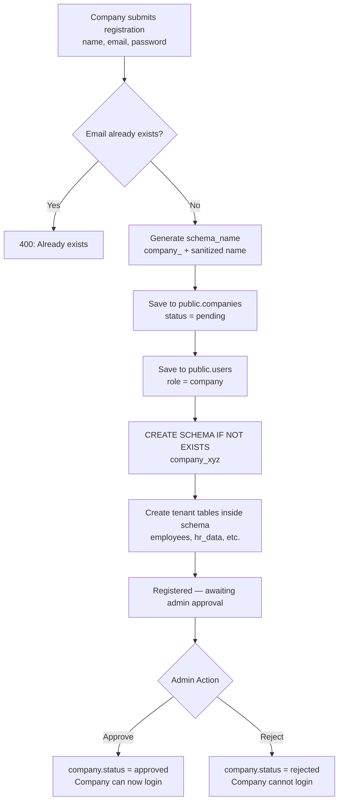
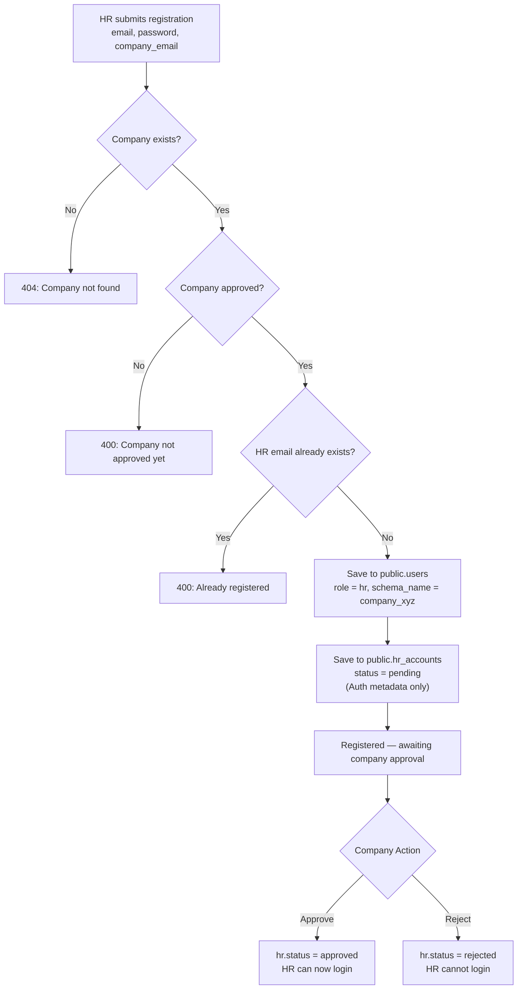
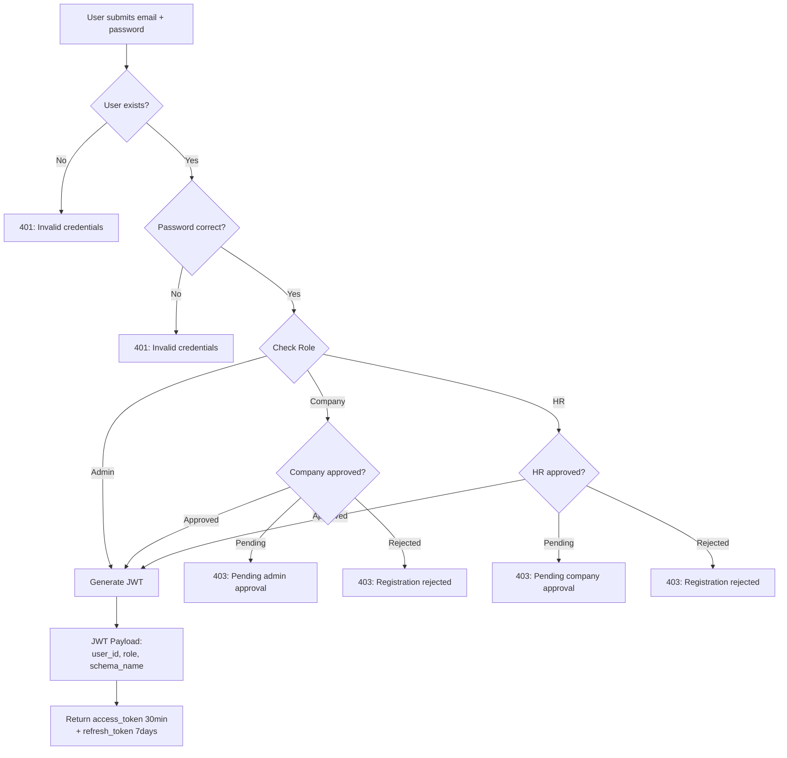
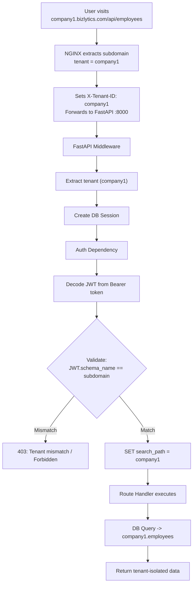
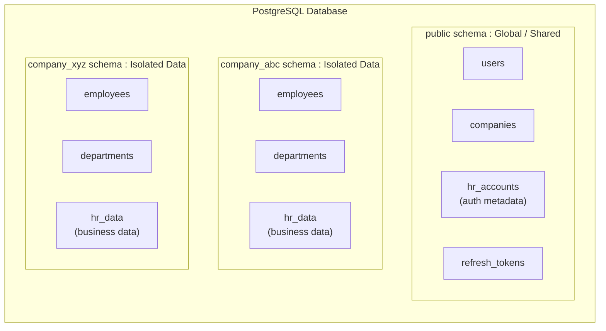
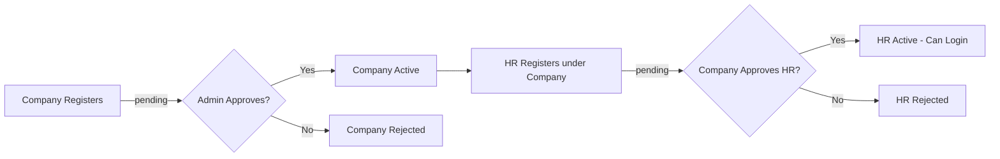
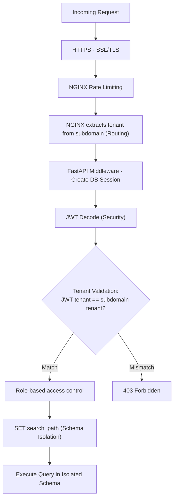

# Bizlytics — Complete Auth & Multi-Tenant System Flowchart (Refined)

> Production-Ready Architecture: Final Authority = JWT schema_name (Not Subdomain)

---

## 1. High-Level Architecture

---

## 2. Complete Request Flow (Production)

---

## 3. Company Registration Flow

---

## 4. HR Registration Flow

---

## 5. Login Flow

---

## 6. Authenticated Request Flow (Best Practice Version)

---

## 7. Multi-Tenant Database Layout

---

## 8. Complete Approval Chain

---

## 9. Security Layers (Production)

